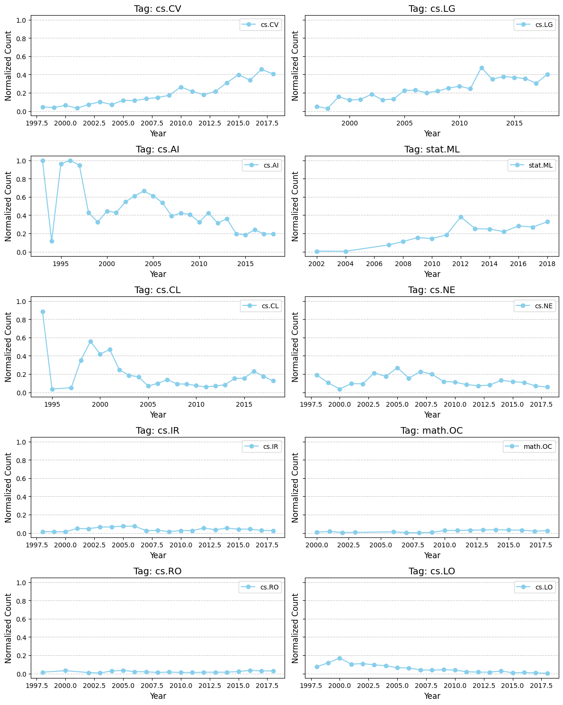
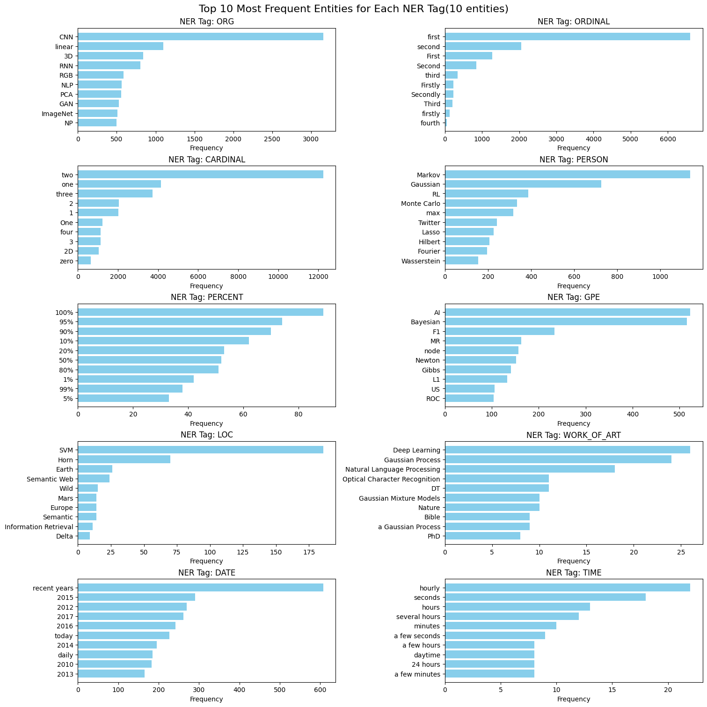

# NLP and Deployment

In this Repo we anaysied a data set nlp-wisely and used the results for learning

- Getting to know better(Exploratory Data Analysis)

<p align="center">
    
    
</p>

- some nlp related:
  - POS Tagging
  - Name-Entity Recognition
  - Embeddings
    - BoW
    - TF-IDF
    - GLoVe
```markdown
Masculine: knight -> Feminine: knight
Masculine: hunter -> Feminine: hunter
Masculine: boy -> Feminine: girl
Masculine: son -> Feminine: daughter
Masculine: grandfather -> Feminine: grandmother
...
```
- Training deployment
  - AutoML
```markdown
model_id                                                mean_per_class_error    logloss      rmse        mse
GBM_grid_1_AutoML_1_20250128_145456_model_1                         0.921999   0.623391  0.337669  0.11402
DeepLearning_grid_1_AutoML_1_20250128_145456_model_3                0.922034   0.746481  0.304669  0.0928233
DeepLearning_grid_1_AutoML_1_20250128_145456_model_1                0.922425   1.20105   0.333376  0.111139
```
  - Neural architecture search


